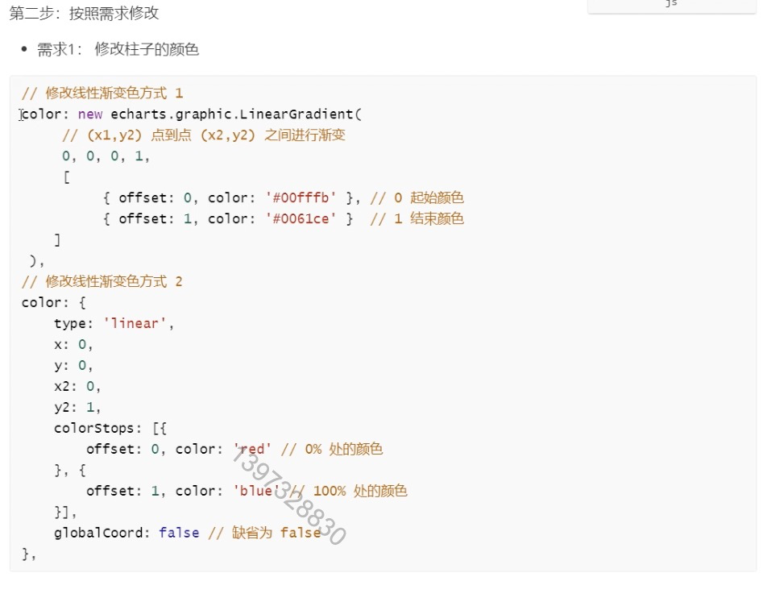
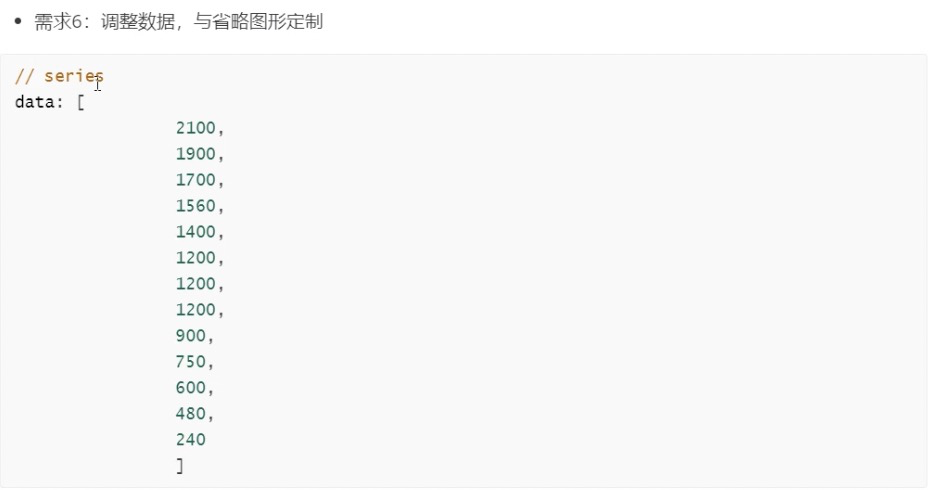
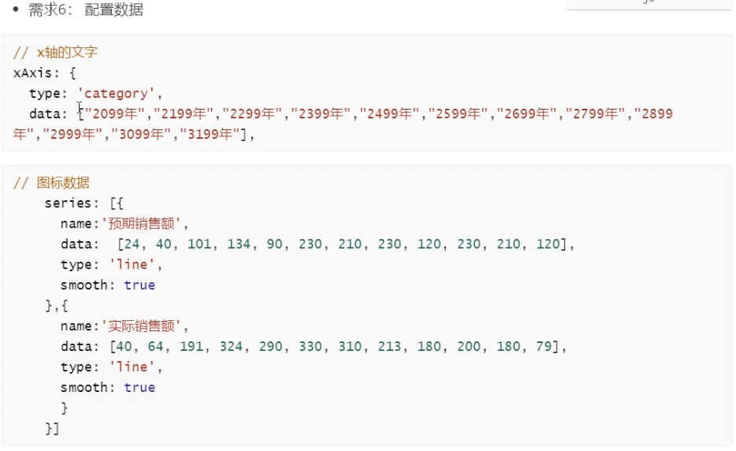
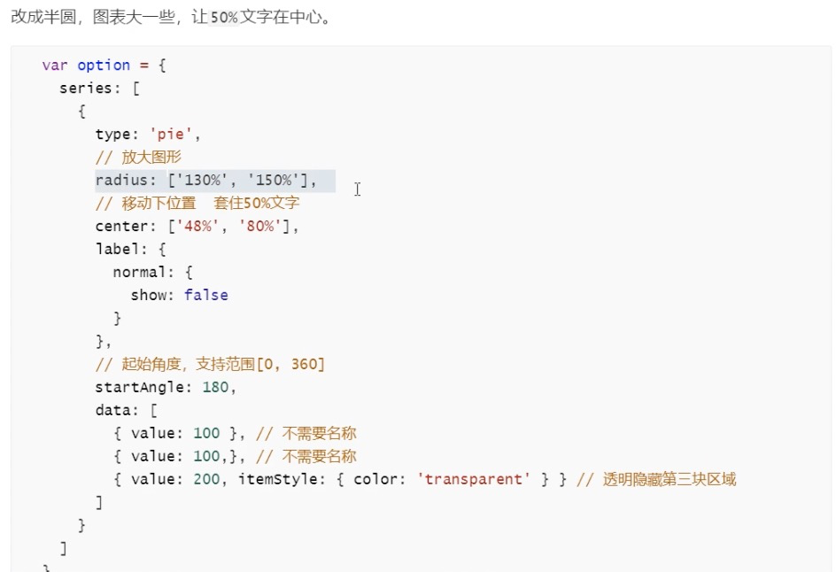

# Echarts教程文档

## 一、项目介绍

## 二、项目使用技术栈

完成该项目需要具备以下知识:

- div + css 布局
- flex 布局
- css3动画
- css3渐变
- css3边框图片
- 原生js + jquery适配
- rem适配

## 三、Echarts体验

### 3.1 官网地址

echarts官网地址:  https://echarts.apache.org/zh/index.html

### 3.2 echarts上手体验

- 5分钟上手echarts :https://echarts.apache.org/handbook/zh/get-started/

- echarts使用五步曲

  | 步骤                                | 作用                              |
  | ----------------------------------- | --------------------------------- |
  | 步骤1: 下载并引入echarts            | 图标依赖这个js库                  |
  | 步骤2:准备一个具备大小的dom容器     | 生成的图表会放入这个容器内        |
  | 步骤3:初始化echarts实例对象         | 实例化echarts对象                 |
  | 步骤4:指定配置项和数据(option)      | 根据具体需求修改配置选项          |
  | 步骤5:将配置项设置给echarts实例对象 | 让echarts对象根据修改好的配置生效 |


- 准备一个具备大小的DOM容器

  ```
  <div id="main" style="width: 600px;height:400px;"></div>
  ```

- 初始化echarts实例对象

  ```
  const main = document.getElementById('main')
    // 基于准备好的dom，初始化echarts实例
  const myChart = echarts.init(main);
  ```

- 指定配置项和数据(option)

  ```
  const option = {
      tooltip: {
        trigger: 'axis',
        axisPointer: {
          type: 'shadow'
        }
      },
      grid: {
        left: '3%',
        right: '4%',
        bottom: '3%',
        containLabel: true
      },
      xAxis: [
        {
          type: 'category',
          data: ['Mon', 'Tue', 'Wed', 'Thu', 'Fri', 'Sat', 'Sun'],
          axisTick: {
            alignWithLabel: true
          }
        }
      ],
      yAxis: [
        {
          type: 'value'
        }
      ],
      series: [
        {
          name: 'Direct',
          type: 'bar',
          barWidth: '60%',
          data: [10, 52, 200, 334, 390, 330, 220]
        }
      ]
    };
  ```

- 将配置项设置给echarts实例对象

  ```
   myChart.setOption(option)
  ```

### 3.3 选择不同图表类型

- 实现引入饼图 (和上面五步曲一样)


## 四、Echarts基础配置

**echarts九大配置信息:**

- title : 标题组件
- tooltip : 提示框组件
- legend : 图例组件
- toolbox : 工具栏
- grid : 直角坐标系内绘图网格
- xAxis : 直角坐标系grid中的x轴
- yAxis : 直角坐标系grid中的y轴
- series : 系列列表
- color : 调色盘颜色列表

### 4.1 echarts配置信息之title tooltip legend toolbox

- title : 标题组件，包含主标题和副标题。

  - Show : 是否显示标题组件。
  - text : 主标题文本，支持使用 `\n` 换行
  - Link : 主标题文本超链接
  - target : 指定窗口打开主标题超链接。
    - `'self'` 当前窗口打开
    - `'blank'` 新窗口打开
  - 更多title配置信息请参考该链接: https://echarts.apache.org/zh/option.html#title.id

- Tooltip: 提示框组件。

  - 更新tooltip配置信息请参考该链接: https://echarts.apache.org/zh/option.html#tooltip

- Legend : 图例组件。

  图例组件展现了不同系列的标记(symbol)，颜色和名字。可以通过点击图例控制哪些系列不显示。

  - 更多Legend配置信息请参考该链接 : https://echarts.apache.org/zh/option.html#legend

- toolbox: 工具栏。内置有[导出图片](https://echarts.apache.org/zh/option.html#toolbox.feature.saveAsImage)，[数据视图](https://echarts.apache.org/zh/option.html#toolbox.feature.dataView)，[动态类型切换](https://echarts.apache.org/zh/option.html#toolbox.feature.magicType)，[数据区域缩放](https://echarts.apache.org/zh/option.html#toolbox.feature.dataZoom)，[重置](https://echarts.apache.org/zh/option.html#toolbox.feature.reset)五个工具。

  - 更多toolbox配置信息请参考该链接 : https://echarts.apache.org/zh/option.html#toolbox

### 4.2 echarts配置信息之grid

- Grid : 直角坐标系内绘图网格，单个 grid 内最多可以放置上下两个 X 轴，左右两个 Y 轴。可以在网格上绘制[折线图](https://echarts.apache.org/zh/option.html#series-line)，[柱状图](https://echarts.apache.org/zh/option.html#series-bar)，[散点图（气泡图）](https://echarts.apache.org/zh/option.html#series-scatter)

  - left : 左侧的距离
  - right : 右侧的距离
  - bottom : 底部的距离
  - containLabel : true.  是否显示y轴的刻度,true显示,false不显示

  更多Grid配置信息请参考该链接: https://echarts.apache.org/zh/option.html#grid

### 4.3 echarts配置信息之x轴y轴

- xAxis : 直角坐标系 grid 中的 x 轴，一般情况下单个 grid 组件最多只能放上下两个 x 轴，多于两个 x 轴需要通过配置 [offset](https://echarts.apache.org/zh/option.html#xAxis.offset) 属性防止同个位置多个 x 轴的重叠。

  参考地址: https://echarts.apache.org/zh/option.html#xAxis

- yAxis : 直角坐标系 grid 中的 y 轴，一般情况下单个 grid 组件最多只能放左右两个 y 轴，多于两个 y 轴需要通过配置 [offset](https://echarts.apache.org/zh/option.html#yAxis.offset) 属性防止同个位置多个 Y 轴的重叠。

  参考地址: https://echarts.apache.org/zh/option.html#yAxis

### 4.4 echarts配置信息之颜色设置

- color : 调色盘颜色列表。如果系列没有设置颜色，则会依次循环从该列表中取颜色作为系列颜色。 默认为：

```ts
['#5470c6', '#91cc75', '#fac858', '#ee6666', '#73c0de', '#3ba272', '#fc8452', '#9a60b4', '#ea7ccc']
```

### 4.5 echarts配置信息之series

**Series:系列列表**

- type: 类型

- name : 系列名称, 用于tooltip的现实,legend的图例筛选变化

- stack : 数据堆叠. 如果设置相同值, 则会数据堆叠

  - 数据堆叠: 

    - 第二个数据值 = 第一个数据值 + 第二个数据值
    - 第三个数据值=第二个数据值 + 第三个数据值
    - ...依次类推

    

## 五、REM适配

### 5.1 rem配置方案

- 设计稿时1920px
- pc端适配:  宽度在1024 - 1920之间页面元素宽高自适应
  - Flexible.js 把屏幕分为24等份
  - px2rem插件的基准值时80px
  - 要把屏幕宽度约束在1024 - 1920 之间有适配
- 实现代码:
- 使用插件flexible.js检测浏览器宽度,实时修改html文字大小
- 页面元素根据rem适配大小配置px2rem插件
- 采用flex布局


### 5.2 安装插件px2rem

Flexible.js 把屏幕分为24等份

pc端的效果图时1920px

px2rem插件的基准值是80px

rem值自动生成


要把屏幕宽度约束在1024 - 1920之间有适配, 也就是小于1024以及大于1920都不要进行缩放了

```
@media screen and(max-width : 1024px){
	html{
		font-size : 42.66px !important;
	}
}

@media screen and(min-width : 1920px){
	html{
		font-size : 80px !important;
	}
}
```


## 六、页面布局

### 6.1 背景图片显示

`index.html`

```html
<!DOCTYPE html>
<html lang="en">
<head>
    <meta charset="UTF-8">
    <title>Title</title>
    <link rel="stylesheet" href="css/index.css">
    <script src="js/echarts.min.js"></script>
    <script src="js/flexible.js"></script>
    <script src="js/jquery.min.js"></script>
</head>
<body>
</body>
</html>

```

`index.css`

```css
/*清除元素默认的内外边距  */
* {
    margin: 0;
    padding: 0;
    box-sizing: border-box;
}
/*让所有斜体 不倾斜*/
em,
i {
    font-style: normal;
}
/*去掉列表前面的小点*/
li {
    list-style: none;
}
/*图片没有边框   去掉图片底侧的空白缝隙*/
img {
    border: 0; /*ie6*/
    vertical-align: middle;
}
/*让button 按钮 变成小手*/
button {
    cursor: pointer;
}
/*取消链接的下划线*/
a {
    color: #666;
    text-decoration: none;
}

a:hover {
    color: #e33333;
}

h4 {
    font-weight: 400;
}

@media screen and(max-width : 1024px){
    html{
        font-size : 42.66px !important;
    }
}

@media screen and(min-width : 1920px){
    html{
        font-size : 80px !important;
    }
}

body{
    background: url("../images/bg.jpg") no-repeat;
    background-size : cover;
}
```


### 6.2 实时销售统计图片显示

`index.html`

```html
<!DOCTYPE html>
<html lang="en">
<head>
    <meta charset="UTF-8">
    <title>Title</title>
    <link rel="stylesheet" href="css/index.css">
    <script src="js/echarts.min.js"></script>
    <script src="js/flexible.js"></script>
    <script src="js/jquery.min.js"></script>
</head>
<body>
    <div class="viewport">
			123
    </div>
</body>
</html>

```

`Index.css`

```css
.viewport{
    min-width: 12.8rem;
    max-width: 24rem;
    background: url("../images/logo.png") no-repeat;
    background-size: contain;
    min-height: 780px;
    margin: 0 auto;
    padding: 1.1rem 0.25rem 0;
    color : #fff;
}
```

### 6.3 页面flex布局划分

`index.html`

```
<!DOCTYPE html>
<html lang="en">
<head>
    <meta charset="UTF-8">
    <title>Title</title>
    <link rel="stylesheet" href="css/index.css">
    <script src="js/echarts.min.js"></script>
    <script src="js/flexible.js"></script>
    <script src="js/jquery.min.js"></script>
</head>
<body>
    <div class="viewport">
        <div class="column">1</div>
        <div class="column">2</div>
        <div class="column">3</div>
    </div>
</body>
</html>
```

`index.css`

```
.viewport{
    display: flex;
    min-width: 12.8rem;
    max-width: 24rem;
    background: url("../images/logo.png") no-repeat;
    background-size: contain;
    min-height: 780px;
    margin: 0 auto;
    padding: 1.1rem 0.25rem 0;
    color : #fff;
}

.viewport .column{
    flex : 3;
    background-color: yellowgreen;
}

.viewport .column:nth-child(2){
    flex : 4;
    background-color: #e33333;
}
```


## 七、边框图片


**边框图片使用案例**

```html
<!DOCTYPE html>
<html lang="en">
<head>
    <meta charset="UTF-8">
    <title>Title</title>
    <style>
        div{
            width: 300px;
            height: 400px;
            border : 15px solid yellowgreen;
            border-image: url("images/border.jpg");
            border-image-slice: 165 165 165 165;
            border-image-width: 30px;
            border-image-repeat: repeat;
        }
    </style>
</head>
<body>
    <div>123</div>
</body>
</html>

```


## 八、公用面板样式


`css/index.css`

```css
/*清除元素默认的内外边距  */
* {
    margin: 0;
    padding: 0;
    box-sizing: border-box;
}
/*让所有斜体 不倾斜*/
em,
i {
    font-style: normal;
}
/*去掉列表前面的小点*/
li {
    list-style: none;
}
/*图片没有边框   去掉图片底侧的空白缝隙*/
img {
    border: 0; /*ie6*/
    vertical-align: middle;
}
/*让button 按钮 变成小手*/
button {
    cursor: pointer;
}
/*取消链接的下划线*/
a {
    color: #666;
    text-decoration: none;
}

a:hover {
    color: #e33333;
}

h4 {
    font-weight: 400;
}

@media screen and (max-width : 1024px){
    html{
        font-size : 42.66px !important;
    }
}

@media screen and (min-width : 1920px){
    html{
        font-size : 80px !important;
    }
}


.viewport{
    display: flex;
    min-width: 12.8rem;
    max-width: 24rem;
    background: url("../images/logo.png") no-repeat;
    background-size: contain;
    min-height: 780px;
    margin: 0 auto;
    padding: 1.1rem 0.25rem 0;
    color : #fff;
}

.viewport .column{
    flex : 3;
    background-color: yellowgreen;
}

.viewport .column:nth-child(2){
    flex : 4;
    background-color: #e33333;
}


.panel{
    position: relative;
    border : 15px solid transparent;
    border-image-source: url("../images/border.png");
    border-width: 0.6375rem 0.475rem 0.25rem 1.65rem;
    border-image-slice: 51 38 20 132;
    margin-bottom: .25rem;
}

.panel .inner{
    position: absolute;
    top : -0.6375rem;
    right : -0.475rem;
    bottom : -0.25rem;
    left : -1.65rem;
}

.panel h3{
    font-size: 0.25rem;
    color : #fff;
    font-weight: bold;
}

```


`Index.html`

```html
<!DOCTYPE html>
<html lang="en">
<head>
    <meta charset="UTF-8">
    <title>Title</title>
    <link rel="stylesheet" href="css/index.css">
    <script src="js/echarts.min.js"></script>
    <script src="js/flexible.js"></script>
    <script src="js/jquery.min.js"></script>
</head>
<body>
    <div class="viewport">
        <div class="column">
            <div class="panel">
               <div class="inner"></div>
          	</div>
        </div>
        <div class="column">2</div>
        <div class="column">3</div>
    </div>
</body>
</html>

```


## 九、概览区域布局


`index.html`

```
<!DOCTYPE html>
<html lang="en">
<head>
    <meta charset="UTF-8">
    <title>Title</title>
    <link rel="stylesheet" href="css/index.css">
    <script src="js/echarts.min.js"></script>
    <script src="js/flexible.js"></script>
    <script src="js/jquery.min.js"></script>
</head>
<body>
    <div class="viewport">
    <div class="column">
        <div class="panel overview">
            <div class="inner">
                <ul>
                    <li>
                        <h4>30万</h4>
                        <span><i class="icon-dot" style="color: #006cff"></i>当日销量</span>
                    </li>
                    <li class="item">
                        <h4>120万</h4>
                        <span><i class="icon-dot" style="color: #6acca3"></i>当月销量</span>
                    </li>
                    <li>
                        <h4>359万</h4>
                        <span><i class="icon-dot" style="color: #6acca3"></i>当季销量</span>
                    </li>
                    <li>
                        <h4>1,390万</h4>
                        <span><i class="icon-dot" style="color: #ed3f35"></i>当年销量</span>
                    </li>
                </ul>
            </div>
        </div>
    </div>
    <div class="column">2</div>
    <div class="column">3</div>
</div>
</body>
</html>

```


`index.css`

```
/**概览区域**/
.overview {
    height: 1.375rem;
}

.overview ul {
    display: flex;
    justify-content: space-between;
}


.overview ul li h4 {
    font-size: 0.35rem;
    color: #fff;
    margin: 0 0 0 0.06rem;
}

.overview ul li span {
    color: #4c9bfd;
    font-size: 0.2rem;
    position: relative;
    top: -10px;
}

```


## 十、监控区域布局

`index.html`

```
<div class="panel monitor">
            <div class="inner">
                <div class="tabs">
                    <a href="javascript:;" class="active">实时交易详情</a>
                    <a href="javascript:;">实时注册详情</a>
                </div>
                <div class="content" style="display: block;">
                    <div class="head">
                        <span class="col">交易时间</span>
                        <span class="col">交易地区</span>
                        <span class="col">交易金额</span>
                    </div>
                    <div class="marquee-view">
                        <div class="marquee">
                            <div class="row">
                                <span class="col">10:00:01</span>
                                <span class="col">上海市黄浦区</span>
                                <span class="col">1328元</span>
                                <span class="icon-dot"></span>
                            </div>
                            <div class="row">
                                <span class="col">10:00:02</span>
                                <span class="col">北京市西城区</span>
                                <span class="col">328元</span>
                                <span class="icon-dot"></span>
                            </div>
                            <div class="row">
                                <span class="col">10:00:03</span>
                                <span class="col">江苏省苏州市虎丘区</span>
                                <span class="col">28元</span>
                                <span class="icon-dot"></span>
                            </div>
                            <div class="row">
                                <span class="col">10:00:05</span>
                                <span class="col">广东省广州市天河区</span>
                                <span class="col">18元</span>
                                <span class="icon-dot"></span>
                            </div>
                            <div class="row">
                                <span class="col">10:00:07</span>
                                <span class="col">浙江省杭州市西湖区</span>
                                <span class="col">58元</span>
                                <span class="icon-dot"></span>
                            </div>
                            <div class="row">
                                <span class="col">10:00:09</span>
                                <span class="col">安徽省合肥市包河区</span>
                                <span class="col">98元</span>
                                <span class="icon-dot"></span>
                            </div>
                            <div class="row">
                                <span class="col">10:00:25</span>
                                <span class="col">福建省厦门市湖里区</span>
                                <span class="col">108元</span>
                                <span class="icon-dot"></span>
                            </div>
                            <div class="row">
                                <span class="col">10:00:30</span>
                                <span class="col">江西省南昌市东湖区</span>
                                <span class="col">77元</span>
                                <span class="icon-dot"></span>
                            </div>
                            <div class="row">
                                <span class="col">10:00:32</span>
                                <span class="col">山东省济南市市中区</span>
                                <span class="col">66元</span>
                                <span class="icon-dot"></span>
                            </div>
                            <div class="row">
                                <span class="col">10:00:58</span>
                                <span class="col">湖北省武汉市江岸区</span>
                                <span class="col">99元</span>
                                <span class="icon-dot"></span>
                            </div>
                        </div>
                    </div>
                </div>

                <div class="content">
                    <div class="head">
                        <span class="col">注册时间</span>
                        <span class="col">注册地区</span>
                        <span class="col">客户性别</span>
                    </div>
                    <div class="marquee-view">
                        <div class="marquee">
                            <div class="row">
                                <span class="col">10:00:01</span>
                                <span class="col">上海市黄浦区</span>
                                <span class="col">男</span>
                                <span class="icon-dot"></span>
                            </div>
                            <div class="row">
                                <span class="col">10:00:02</span>
                                <span class="col">北京市西城区</span>
                                <span class="col">男</span>
                                <span class="icon-dot"></span>
                            </div>
                            <div class="row">
                                <span class="col">10:00:03</span>
                                <span class="col">江苏省苏州市虎丘区</span>
                                <span class="col">女</span>
                                <span class="icon-dot"></span>
                            </div>
                            <div class="row">
                                <span class="col">10:00:05</span>
                                <span class="col">广东省广州市天河区</span>
                                <span class="col">男</span>
                                <span class="icon-dot"></span>
                            </div>
                            <div class="row">
                                <span class="col">10:00:07</span>
                                <span class="col">浙江省杭州市西湖区</span>
                                <span class="col">男</span>
                                <span class="icon-dot"></span>
                            </div>
                            <div class="row">
                                <span class="col">10:00:09</span>
                                <span class="col">安徽省合肥市包河区</span>
                                <span class="col">男</span>
                                <span class="icon-dot"></span>
                            </div>
                            <div class="row">
                                <span class="col">10:00:25</span>
                                <span class="col">福建省厦门市湖里区</span>
                                <span class="col">女</span>
                                <span class="icon-dot"></span>
                            </div>
                            <div class="row">
                                <span class="col">10:00:30</span>
                                <span class="col">江西省南昌市东湖区</span>
                                <span class="col">女</span>
                                <span class="icon-dot"></span>
                            </div>
                            <div class="row">
                                <span class="col">10:00:32</span>
                                <span class="col">山东省济南市市中区</span>
                                <span class="col">男</span>
                                <span class="icon-dot"></span>
                            </div>
                            <div class="row">
                                <span class="col">10:00:58</span>
                                <span class="col">湖北省武汉市江岸区</span>
                                <span class="col">男</span>
                                <span class="icon-dot"></span>
                            </div>
                        </div>
                    </div>
                </div>
            </div>
        </div>
```

`Index.css`

```

/* 监控区域 */
.monitor{
    height: 6rem;
}
.monitor .inner{
    padding: .3rem 0;
    display: flex;
    flex-direction: column;
}
.monitor .tabs{
    padding: 0 .45rem;
    margin-bottom: 0.225rem;
    display: flex;
}
.monitor .tabs a{
    color:#1950c4;
    font-size: 0.225rem;
    padding: 0 .3375rem;
}
.monitor .tabs a:first-child{
    padding-left: 0;
    border-right: 0.025rem solid #00f2f1;
}
.monitor .tabs a.active{
    color: #fff;
}
.monitor .content{
    flex: 1;
    position: relative;
    display: none;
}
.monitor .head{
    display: flex;
    justify-content: space-between;
    line-height: 1.05;
    background-color: rgba(255, 255, 255, 0.1);
    padding: 0.15rem 0.45rem;
    color: #68d8fe;
    font-size: 0.175rem;
}
.monitor .marquee-view {
    position: absolute;
    top: 0.5rem;
    bottom: 0;
    width: 100%;
    overflow: hidden;
}
.monitor .row{
    display: flex;
    justify-content: space-between;
    line-height: 1.05;
    font-size: 0.15rem;
    color: #61a8ff;
    padding: 0.15rem 0.45rem;
}
.monitor .row .icon-dot{
    position: absolute;
    left: 0.2rem;
    opacity: 0;
}
.monitor .row:hover {
    background-color: rgba(255, 255, 255, 0.1);
    color: #68d8fe;
}
.monitor .row:hover .icon-dot{
    opacity: 1;
}
.monitor .col:first-child{
    width: 1rem;
}
.monitor .col:nth-child(2){
    width: 2.5rem;
    white-space: nowrap;
    text-overflow: ellipsis;
    overflow: hidden;
}
.monitor .col:nth-child(3){
    width: 1rem;
}


.marquee-view .marquee {
    animation: move 15s linear infinite;
}

@keyframes move {
    0% {

    }
    100% {
        transform: translateY(-50%);
    }
}

.marquee-view .marquee:hover {
    animation-play-state: paused;
}
```

## 十一、tabs栏事件处理

`index.js`

```javascript
(function (){
    $(".monitor .tabs").on("click","a",function () {
        $(this).addClass("active").siblings("a").removeClass("active");
        $(".monitor .content").eq($(this).index()).show().siblings(".content").hide();
    })
})()
```

## 十二、交易区滚动事件

`Index.css`

```
.marquee-view .marquee {
    animation: move 15s linear infinite;
}

@keyframes move {
    0% {

    }
    100% {
        transform: translateY(-50%);
    }
}

.marquee-view .marquee:hover {
    animation-play-state: paused;
}
```

## 十三、交易区实时滚动

`Index.js`

```
$(".marquee-view .marquee").each(function () {
        console.log($(this))
        var rows = $(this).children().clone()
        $(this).append(rows)
    })
```


## 十四、销售区布局

### 14.1 销售区域布局


`index.html`

```html
<div class="panel point">
            <div class="inner">
                <h3>销售地分布统计</h3>
                <div class="chart">
                    <div class="pie"></div>
                    <div class="data">
                        <div class="item">
                            <h4>320,11</h4>
                            <span>
                                <i class="icon-dot" style="color: #ed3f35;"></i>
                                销量总数
                            </span>
                        </div>
                        <div class="item">
                            <h4>12%</h4>
                            <span>
                                <i class="icon-dot" style="color: #eacf19;"></i>
                                同比增长
                            </span>
                        </div>
                    </div>
                </div>
            </div>
        </div>
```

`Index.css`

```css
/*销售分布*/
.point{
    height : 4.25rem;
}
.point .chart{
    display: flex;
    justify-content: space-between;
    margin-top: 0.3rem;
}
.point .pie{
    width : 3.9rem;
    height : 3rem;
    background-color: yellowgreen;
    margin-left: -0.125rem;
}
.point .data{
    display: flex;
    flex-direction: column;
    justify-content: space-between;
    width: 2.1rem;
    background: url("../images/rect.png");
    background-size: cover;
    padding:.45rem .375rem;
    box-sizing: border-box;
}
.point h4{
    color : #fff;
    font-size:0.35rem;
    margin-bottom: 0.15rem;
}
.point span{
    color : #4c9bfd;
    display: block;
    font-size: 0.2rem;
}

```

### 14.2 销售区域饼图引入


`Index.js`

```
(function (){
    let myChart = echarts.init(document.querySelector(".pie"))

    let option = {
        tooltip: {
            trigger: 'item',
            formatter: '{a} <br/>{b} : {c} ({d}%)'
        },
        series: [
            {
                name: 'Area Mode',
                type: 'pie',
                radius: [20, 140],
                center: ['75%', '50%'],
                roseType: 'area',
                itemStyle: {
                    borderRadius: 5
                },
                data: [
                    { value: 30, name: 'rose 1' },
                    { value: 28, name: 'rose 2' },
                    { value: 26, name: 'rose 3' },
                    { value: 24, name: 'rose 4' },
                    { value: 22, name: 'rose 5' },
                    { value: 20, name: 'rose 6' },
                    { value: 18, name: 'rose 7' },
                    { value: 16, name: 'rose 8' }
                ]
            }
        ]
    };

    myChart.setOption(option)
})();

```


### 14.3 饼图的tooltip说明

- a : 系列名称 , 也就是series里面 的name的值
- b : 数据项名称, 也就是series里面 的data里面的name的值
- c : 数值 ,  也就是series里面 的 data里面的value的值
- d : 百分比, 也就是data里面的value值除以总值得出来的结果

### 14.4 饼图的series说明

- name : 
- Type : pie 表示当前图表的类型为饼图
- radius : [20,140]  饼图内部的半径以及饼图外部的半径
- center : [“75%”, “50%”]  饼图的位置
- roseType : “area” 显示的类型 area 或者 radius
- itemStyle :  [borderRadius : 50] 边框的半径
- Data : 

### 14.5 项目饼图的定制配置1


`index.js`

```javascript
let option = {
        color : ["#006cff","#60cda0", "#ed8884", "#ff9f7f", "#0096ff", "#9fe6b8", "#32c5e9", "#1d9dff"],
        tooltip: {
            trigger: 'item',
            formatter: '{a} <br/>{b} : {c} ({d}%)'
        },
        series: [
            {
                name: '面积模式',
                type: 'pie',
                radius: ["10%", "70%"],
                center: ['50%', '50%'],
                roseType: 'radius',
                itemStyle: {
                    borderRadius: 5
                },
                data: [
                    { value: 22, name: "云南" },
                    { value: 28, name: "北京" },
                    { value: 25, name: "山东" },
                    { value: 25, name: "河北" },
                    { value: 32, name: "江苏" },
                    { value: 22, name: "浙江" },
                    { value: 31, name: "四川" },
                    { value: 42, name: "上海" }
                ]
            }
        ]
    };
```


### 14.6项目饼图的定制配置2


### 14.7 echarts图标适配浏览器

```javascript
 window.addEventListener("resize", function (){
        myChart.resize()
 })
```

### 14.8 地图模块布局


`Index.html`

```
<div class="column">
        <!--地图-->
        <div class="map">
            <h3>
                <span class="icon-cube"></span>
                设备数据统计
            </h3>
            <div class="chart">
                <div class="geo"></div>
            </div>
        </div>
    </div>
```

`index.css`

```css
.map{
    height : 7.225rem;
    margin-bottom: 0.25rem;
    display: flex;
    flex-direction: column;
}
.map h3{
    line-height: 1;
    padding : 0.2rem 0;
    margin: 0;
    font-size: 0.25rem;
    color : #fff;
    font-weight: 400;
}
.map .icon-cube{
    color : #68d8fe;
}
.map .chart{
    flex : 1;
    background-color: rgba(255,255,255,0.05);
}
.map .geo{
    width: 100%;
    height: 100%;
}

/*注意: 第二列column有个外边距 上 32 左右 20 下 0*/
.viewport .column:nth-child(2) {
    flex: 4;
    margin: .4rem .25rem 0;
}
```

## 十五、用户统计模块布局


`Index.html`

```html
<div class="panel users">
            <div class="inner">
                <h3>全国用户总量统计</h3>
                <div class="chart">
                    <div class="bar"></div>
                    <div class="data">
                        <div class="item">
                            <h4>161,888</h4>
                            <span>
                                <i class="icon-dot" style="color : #ed3f35;"></i>
                                用户总量
                            </span>
                        </div>
                        <div class="item">
                            <h4>248</h4>
                            <span>
                                <i class="icon-dot" style="color : #eacf19;"></i>
                                本月新增
                            </span>
                        </div>
                    </div>
                </div>
            </div>
        </div>
```

`index.css`

```css
/*用户统计*/
.users{
    height : 4.25rem;
    flex : 1;
}
.users .chart{
    display: flex;
    margin-top: 0.3rem;
}
.users .bar{
    width: 7.35rem;
    height: 3rem;
}
.users .data{
    display: flex;
    flex-direction: column;
    justify-content: space-between;
    width: 2.1rem;
    min-width: 100px;
    padding: 0.45rem 0.375rem;
    box-sizing: border-box;
    background: url("../images/rect.png");
    background-size: cover;
}
.users h4{
    color : #fff;
    font-size:0.35rem;
    margin-bottom: 0.15rem;
}
.users span{
    color : #4c9bfd;
    display: block;
    font-size: 0.15rem;
}

```


### 15.1 引入柱状图


`Index.js`

```javascript
(function (){
    $(document).ready(function (){
        let myChart = echarts.init(document.querySelector(".bar"))

        let option = {
            tooltip: {
                trigger: 'axis',
                axisPointer: {
                    type: 'shadow'
                }
            },
            grid: {
                left: '3%',
                right: '4%',
                bottom: '3%',
                containLabel: true
            },
            xAxis: [
                {
                    type: 'category',
                    data: ['Mon', 'Tue', 'Wed', 'Thu', 'Fri', 'Sat', 'Sun'],
                    axisTick: {
                        alignWithLabel: true
                    }
                }
            ],
            yAxis: [
                {
                    type: 'value'
                }
            ],
            series: [
                {
                    name: 'Direct',
                    type: 'bar',
                    barWidth: '20%',
                    data: [10, 52, 200, 334, 390, 330, 220]
                }
            ]
        };

        myChart.setOption(option)

        window.addEventListener("resize", function (){
            myChart.resize()
        })
    })
})();
```


### 15.2 修改柱子颜色和提示框样式




`index.js -- option`

```javascript
color : new echarts.graphic.LinearGradient(
                0, 0, 0, 1,
                [
                    {offset : 0, color : "#00fffb"},
                    {offset : 1, color : "#0061ce"}
                ]
            ),
            tooltip: {
                trigger: 'item',
            },
```


### 15.3 bar的网格设置


`index.js -- option`

```javascript
grid: {
                top : '3%',
                right: '3%',
                bottom: '3%',
                left: '0%',
                containLabel: true,
                show : true,
                borderColor : "rgba(0,240,255,0.3)"
            },
```


### 15.4 设置x轴属性


`Index.js -- option`

```javascript
xAxis: [
                {
                    type: 'category',
                    data: ['Mon', 'Tue', 'Wed', 'Thu', 'Fri', 'Sat', 'Sun'],
                    axisTick: {
                        alignWithLabel: false,
                        show : false
                    },
                    axisLabel:{
                        color : "#4c9bfd"
                    },
                    axisLine : {
                        lineStyle : {
                            color : "rgba(0,240,255,0.3)"
                        }
                    }
                }
            ],
```

### 15.5 设置y轴属性


`Index.js --option`

```javascript
yAxis: [
                {
                    type: 'value',
                    axisTick: {
                        alignWithLabel: false,
                        show : false
                    },
                    axisLabel:{
                        color : "#4c9bfd"
                    },
                    axisLine : {
                        lineStyle : {
                            color : "rgba(0,240,255,0.3)"
                        }
                    },
                    splitLine : {
                        lineStyle : {
                            color : "rgba(0,240,255,0.3)"
                        }
                    }
                }
            ],
```


### 15.6 填充柱状图数据





`Index.js -- option`

```javascript
xAxis: [
                {
                    type: 'category',
                    data: [
                        "上海",
                        "广州",
                        "北京",
                        "深圳",
                        "合肥",
                        "",
                        "......",
                        "",
                        "杭州",
                        "厦门",
                        "济南",
                        "成都",
                        "重庆"
                    ],
                    axisTick: {
                        alignWithLabel: false,
                        show : false
                    },
                    axisLabel:{
                        color : "#4c9bfd"
                    },
                    axisLine : {
                        lineStyle : {
                            color : "rgba(0,240,255,0.3)"
                        }
                    }
                }
            ],
            yAxis: [
                {
                    type: 'value',
                    axisTick: {
                        alignWithLabel: false,
                        show : false
                    },
                    axisLabel:{
                        color : "#4c9bfd"
                    },
                    axisLine : {
                        lineStyle : {
                            color : "rgba(0,240,255,0.3)"
                        }
                    },
                    splitLine : {
                        lineStyle : {
                            color : "rgba(0,240,255,0.3)"
                        }
                    }
                }
            ],
            series: [
                {
                    name: '用户总量',
                    type: 'bar',
                    barWidth: '60%',
                    data: [
                        2100,
                        1900,
                        1700,
                        1560,
                        1400,
                        1200,
                        1200,
                        1200,
                        900,
                        750,
                        600,
                        480,
                        240
                    ]
                }
            ]
```

### 15.7 单独设置某个柱子样式1


### 15.8 单独设置某个柱子样式2

## 十六、订单模块布局

### 16.0 订单模块布局

`index.html`

```html
<div class="panel order">
            <div class="inner">
                <div class="filter">
                    <a class="active" href="javascript:;">365天</a>
                    <a href="javascript:;">90天</a>
                    <a href="javascript:;">30天</a>
                    <a href="javascript:;">24小时</a>
                </div>
                <div class="data">
                    <div class="item">
                        <h4>30,321,988</h4>
                        <span>
							<i class="icon-dot" style="color : #ed3f35"></i>订单量
						</span>
                    </div>
                    <div class="item">
                        <h4>99882</h4>
                        <span>
                            <i class="icon-dot" style="color : #eacf19"></i>销售额(万元)
                        </span>
                    </div>
                </div>
            </div>
        </div>
```

`index.css`

```css

.order {
    height: 1.875rem;
}
.order .filter {
    display: flex;
}
.order .filter a {
    display: block;
    height: 0.225rem;
    line-height: 1;
    padding: 0 0.225rem;
    color: #1950c4;
    font-size: 0.225rem;
    border-right: 0.025rem solid #00f2f1;
}
.order .filter a:first-child {
    padding-left: 0;
}
.order .filter a:last-child {
    border-right: none;
}
.order .filter a.active {
    color: #fff;
    font-size: 0.25rem;
}
.order .data {
    display: flex;
    margin-top: 0.25rem;
}
.order .item {
    width: 50%;
}
.order h4 {
    font-size: 0.35rem;
    color: #fff;
    margin-bottom: 0.125rem;
}
.order span {
    display: block;
    color: #4c9bfd;
    font-size: 0.2rem;
}
```


### 16.1 完成tab栏切换功能

`Index.html`

```html
<div class="filter">
                    <a class="active" data-type="day365" href="javascript:;">365天</a>
                    <a href="javascript:;" data-type="day90">90天</a>
                    <a href="javascript:;" data-type="day30">30天</a>
                    <a href="javascript:;" data-type="day1">24小时</a>
                </div>
```

`Index.js	`

```javascript

(function() {
    let data = {
        day365: {
            orders: '30,321,988',
            amount: '99882'
        },
        day90: {
            orders: '301,987',
            amount: '9834'
        },
        day30: {
            orders: '1,987',
            amount: '3834'
        },
        day1: {
            orders: '987',
            amount: '834'
        }
    }

    let $h4Order = $(".order h4:eq(0)")
    let $h4Amount = $(".order h4:eq(1)")

    $(".order").on("click",".filter a",function (){
        $(this).addClass("active").siblings("a").removeClass("active")
        const currData = data[this.dataset.type]
        $h4Order.html(currData["orders"])
        $h4Amount.html(currData["amount"])
    })

})();

```


### 16.2 点击a标签改变样式

### 16.3 订单模块布局

## 十七、销售额模块布局

### 17.1 销售额模块布局

`index.html`

```html
<div class="sales panel">
            <div class="inner">
                <div class="caption">
                    <h3>销售额统计</h3>
                    <a href="javascript:;" class="active" data-type="year">年</a>
                    <a href="javascript:;" data-type="quarter">季</a>
                    <a href="javascript:;" data-type="month">月</a>
                    <a href="javascript:;" data-type="week">周</a>
                </div>
                <div class="chart">
                    <div class="label">单位:万</div>
                    <div class="line"></div>
                </div>
            </div>
        </div>
```

`Index.css`

```css
.sales {
    height: 3.1rem;
}
.sales .caption {
    display: flex;
    line-height: 1;
}
.sales h3 {
    height: 0.225rem;
    padding-right: 0.225rem;
    border-right: 0.025rem solid #00f2f1;
}
.sales a {
    padding: 0.05rem;
    font-size: 0.2rem;
    margin: -0.0375rem 0 0 0.2625rem;
    border-radius: 0.0375rem;
    color: #0bace6;
}
.sales a.active {
    background-color: #4c9bfd;
    color: #fff;
}
.sales .inner {
    display: flex;
    flex-direction: column;
}
.sales .chart {
    flex: 1;
    padding-top: 0.1875rem;
    position: relative;
}
.sales .label {
    position: absolute;
    left: 0.525rem;
    top: 0.225rem;
    color: #4996f5;
    font-size: 0.175rem;
}
.sales .line {
    width: 100%;
    height: 100%;
}
```

### 17.2 引入折线图

`Index.js`

```javascript
(function (){
    const myChart = echarts.init(document.querySelector(".line"));
    const option = {

        tooltip: {
            trigger: 'axis'
        },
        legend: {
            data: ['Email', 'Union Ads', 'Video Ads', 'Direct', 'Search Engine']
        },
        grid: {
            left: '3%',
            right: '4%',
            bottom: '3%',
            containLabel: true
        },
        xAxis: {
            type: 'category',
            boundaryGap: false,
            data: ['Mon', 'Tue']
        },
        yAxis: {
            type: 'value'
        },
        series: [
            {
                name: 'Email',
                type: 'line',
                stack: 'Total',
                data: [120, 132, 101, 134, 90, 230, 210]
            },
            {
                name: 'Union Ads',
                type: 'line',
                stack: 'Total',
                data: [220, 182, 191, 234, 290, 330, 310]
            }
        ]
    };
    myChart.setOption(option);
    window.addEventListener("resize", function () {
        myChart.resize()
    })
})();
```


### 17.3 修改网格和图例属性


`Index.js -- option`

```javascript
legend: {
            data: ['Email', 'Union Ads'],
            right : "10%",
            textStyle : {
                color : "#4c9bfd"
            }
        },
          
grid: {
            top : "20%",
            left: '3%',
            right: '4%',
            bottom: '3%',
            show : true,
            borderColor : "#012f4a",
            containLabel: true
        },
```


### 17.4 修改x轴和y轴


`Index.js -- option`

```javascript
xAxis: {
            type: 'category',
            axisTick : {
                show :false
            },
            axisLabel : {
                color : "#4c9bfd"
            },
            axisLine : {
                show : false
            },
            boundaryGap: false,
            data: ['周一', '周二', '周三', '周四']
        },
        yAxis: {
            type: 'value',
            axisTick : {
                show :false
            },
            axisLabel : {
                color : "#4c9bfd"
            },
            splitLine : {
                lineStyle : {
                    color : "#012f4a"
                }
            }
        },
```


### 17.5 修改线的颜色、 折线的平滑度以及数据填充





`index.js --- option`

```javascript
legend: {
            data: ['预期销售额', '实际销售额'],
            right : "10%",
            textStyle : {
                color : "#4c9bfd"
            }
        },
          
 xAxis: {
            type: 'category',
            axisTick : {
                show :false
            },
            axisLabel : {
                color : "#4c9bfd"
            },
            axisLine : {
                show : false
            },
            boundaryGap: false,
            // data: ['周一', '周二', '周三', '周四']
            data: ["2099年","2199年","2299年","2399年","2499年","2599年","2699年","2799年","2899年","2999年","3099年","3199年"],
        },
          
          
 series: [
            {
                name: '预期销售额',
                type: 'line',
                stack: 'Total',
                smooth : true,
                // data: [120, 132, 101, 134, 90, 230, 210]
                data: [24, 40, 101, 134, 90, 230, 210, 230, 120, 230, 210, 120],
            },
            {
                name: '实际销售额',
                type: 'line',
                stack: 'Total',
                smooth : true,
                // data: [220, 182, 191, 234, 290, 330, 310]
                data : [40, 64, 191, 324, 290, 330, 310, 213, 180, 200, 180, 79]
            }
        ]
```


### 17.6 分析tab栏的事件


- 定义动态的数据

```javascript
 const data = {
        year: {
            info:["2099年","2199年","2299年","2399年","2499年","2599年","2699年","2799年","2899年","2999年","3099年","3199年"],
            detail:[
                [24, 40, 101, 134, 90, 230, 210, 230, 120, 230, 210, 120],
                [40, 64, 191, 324, 290, 330, 310, 213, 180, 200, 180, 79]
            ],
        },


        quarter: {
            info:["1季度","2季度","3季度","4季度"],
            detail: [
                [23, 75, 12, 97],
                [43, 31, 65, 23]
            ],

        },


        month: {
            info:["1月", "2月", "3月", "4月", "5月", "6月", "7月","8月","9月","10月","11月","12月"],
            detail: [
                [34, 87, 32, 76, 98, 12, 32, 87, 39, 36, 29, 36],
                [56, 43, 98, 21, 56, 87, 43, 12, 43, 54, 12, 98]
            ],
        },

        week: {
            info: ["近1周", "近2周", "近3周", "近4周", "近5周", "近6周"],
            detail: [
                [43, 73, 62, 54, 91, 54, 84, 43, 86, 43, 54, 53],
                [32, 54, 34, 87, 32, 45, 62, 68, 93, 54, 54, 24]
            ]
        }
    };
```


```javascript

```


### 17.7 点击切换事件和数据匹配

```javascript
$(".sales .caption").on("click","a",function () {
        $(this).addClass("active").siblings("a").removeClass("active")
    })
```


### 17.8 点击事件渲染图标

```javascript
$(".sales .caption").on("click","a",function () {
        index = $(this).index() - 1
        $(this).addClass("active").siblings("a").removeClass("active")

        let arr = data[this.dataset.type]
        console.log(arr)
        let info = arr.info
        let detail = arr.detail
        option.xAxis.data = info
        option.series[0].data = detail[0]
        option.series[1].data = detail[1]
        myChart.setOption(option);
    })
```


### 17.9 定时任务书写

```javascript
var as = $(".sales .caption a");
    var index = 0;
    var timer = setInterval(function () {
        index++;
        if (index>=4) index=0;
        as.eq(index).click()
    },1000);

```


### 17.10 鼠标经过销售额取消定时任务事件

```javascript
 $(".sales").hover(function () {
        clearInterval(timer)
    }, function () {
        clearInterval(timer)
        timer = setInterval(function () {
            index++;
            if (index>=4) index=0;
            as.eq(index).click()
        },1000);
    })
```


### 17.11 修复定时任务BUG


## 十八、渠道销售布局

### 18.1 渠道销售布局

`index.html`

```html
 <div class="wrap">
            <div class="channel panel">
                <div class="inner">
                    <h3>渠道分布</h3>
                    <div class="data">
                        <div class="radar"></div>
                    </div>
                </div>
            </div>
            <div class="quarter panel">
                <div class="inner">
                    <h3>一季度销售进度</h3>
                    <div class="chart">
                        <div class="box">
                            <div class="gauge"></div>
                            <div class="label">50<small> %</small></div>
                        </div>
                        <div class="data">
                            <div class="item">
                                <h4>1,321</h4>
                                <span>
                      <i class="icon-dot" style="color: #6acca3"></i>
                      销售额(万元)
                    </span>
                            </div>
                            <div class="item">
                                <h4>150%</h4>
                                <span>
                      <i class="icon-dot" style="color: #ed3f35"></i>
                      同比增长
                    </span>
                            </div>
                        </div>
                    </div>
                </div>
            </div>
        </div>
```


`index.css`

```css
/* 渠道区块 */
.wrap {
    display: flex;
}
.channel,
.quarter {
    flex: 1;
    height: 2.9rem;
}
.channel {
    margin-right: 0.25rem;
}
.channel .data {
    overflow: hidden;
}
.channel .data .radar {
    height: 2.1rem;
    width: 100%;
}
.channel h4 {
    color: #fff;
    font-size: 0.4rem;
    margin-bottom: 0.0625rem;
}
.channel small {
    font-size: 50%;
}
.channel span {
    display: block;
    color: #4c9bfd;
    font-size: 0.175rem;
}
/* 季度区块 */
.quarter .inner {
    display: flex;
    flex-direction: column;
    margin: 0 -0.075rem;
}
.quarter .chart {
    flex: 1;
    padding-top: 0.225rem;
}
.quarter .box {
    position: relative;
}
.quarter .label {
    transform: translate(-50%, -30%);
    color: #fff;
    font-size: 0.375rem;
    position: absolute;
    left: 50%;
    top: 50%;
}
.quarter .label small {
    font-size: 50%;
}
.quarter .gauge {
    height: 1.05rem;
}
.quarter .data {
    display: flex;
    justify-content: space-between;
}
.quarter .item {
    width: 50%;
}
.quarter h4 {
    color: #fff;
    font-size: 0.3rem;
    margin-bottom: 0.125rem;
}
.quarter span {
    display: block;
    width: 100%;
    white-space: nowrap;
    text-overflow: ellipsis;
    overflow: hidden;
    color: #4c9bfd;
    font-size: 0.175rem;
}
```


### 18.2 引入雷达图

`Index.js`

```javascript
  (function (){
    const myChart = echarts.init(document.querySelector(".radar"));

    const dataSH = [
        [91, 45, 125, 0.82, 34, 23, 1]
    ];
    const lineStyle = {
        width: 1,
        opacity: 0.5
    };
    const option = {
        backgroundColor: '#161627',
        radar: {
            indicator: [
                { name: 'AQI', max: 300 },
                { name: 'PM2.5', max: 250 },
                { name: 'PM10', max: 300 },
                { name: 'CO', max: 5 },
                { name: 'NO2', max: 200 },
                { name: 'SO2', max: 100 }
            ],
            shape: 'circle',
            splitNumber: 5,
            axisName: {
                color: 'rgb(238, 197, 102)'
            },
            splitLine: {
                lineStyle: {
                    color: [
                        'rgba(238, 197, 102, 0.1)',
                        'rgba(238, 197, 102, 0.2)',
                        'rgba(238, 197, 102, 0.4)',
                        'rgba(238, 197, 102, 0.6)',
                        'rgba(238, 197, 102, 0.8)',
                        'rgba(238, 197, 102, 1)'
                    ].reverse()
                }
            },
            splitArea: {
                show: false
            },
            axisLine: {
                lineStyle: {
                    color: 'rgba(238, 197, 102, 0.5)'
                }
            }
        },
        series: [
            {
                name: 'Shanghai',
                type: 'radar',
                lineStyle: lineStyle,
                data: dataSH,
                symbol: 'none',
                itemStyle: {
                    color: '#B3E4A1'
                },
                areaStyle: {
                    opacity: 0.05
                }
            }
        ]
    };
    myChart.setOption(option);
    window.addEventListener("resize", function () {
        myChart.resize()
    })
})();

```


### 18.3 雷达图修改center radius 以及split


`Index.js --- option`

```javascript
center : ["50%","50%"],
            radius : "50%",
            shape: 'circle',
            splitNumber: 4,
            axisName: {
                color: 'rgb(238, 197, 102)'
            },
            splitLine: {
                lineStyle: {
                    color: "rgba(255,255,255,0.5)"
                }
            },
```


### 18.4 雷达图修改轴线颜色,字体以及填充区域


`index.js --- option`

```javascript
const option = {
        backgroundColor: '#161627',
        radar: {
            indicator: [
                { name: 'AQI', max: 300 },
                { name: 'PM2.5', max: 250 },
                { name: 'PM10', max: 300 },
                { name: 'CO', max: 5 },
                { name: 'NO2', max: 200 },
                { name: 'SO2', max: 100 }
            ],
            center : ["50%","50%"],
            radius : "50%",
            shape: 'circle',
            splitNumber: 4,
            name: {
               textStyle: {
                   color : "#4c9bfd"
               }
            },
            splitLine: {
                lineStyle: {
                    color: "rgba(255,255,255,0.5)"
                }
            },
            splitArea: {
                show: false
            },
            axisLine: {
                lineStyle: {
                    color: "rgba(255,255,255,0.5)"
                }
            }
        },
        series: [
            {
                name: 'Shanghai',
                type: 'radar',
                lineStyle: {
                    normal : {
                        color : "#fff"
                    }
                },
                data: dataSH,
                symbol: 'none',
                itemStyle: {
                    color: '#B3E4A1'
                },
                areaStyle: {
                    opacity: 'rgba(238, 197, 102, 0.6)'
                }
            }
        ]
    };
```


### 18.5 雷达图引入数据和拐点设置


```index.js
const dataSH = [
        [110, 90, 80, 60, 30],
    ];

    const option = {
        // backgroundColor: '#161627',
        tooltip: {
            show: true,
            position: ["55%", "10%"],
            textStyle:{
                fontSize: 12
            },
        },
        radar: {
            indicator: [
                { name: "淘宝", max: 120},
                { name: "京东", max: 120},
                { name: "苏宁", max: 120},
                { name: "微商", max: 120},
                { name: "其他", max: 120}
            ],
            center : ["50%","50%"],
            radius : "50%",
            shape: 'circle',
            splitNumber: 4,
            name: {
               textStyle: {
                   color : "#4c9bfd"
               }
            },
            splitLine: {
                lineStyle: {
                    color: "rgba(255,255,255,0.5)"
                }
            },
            splitArea: {
                show: false
            },
            axisLine: {
                lineStyle: {
                    color: "rgba(255,255,255,0.5)"
                }
            }
        },
        series: [
            {
                name: '上海',
                type: 'radar',
                lineStyle: {
                    normal : {
                        color : "#fff"
                    }
                },
                data: dataSH,
                symbol: 'circle',
                symbolSize: 5,
                itemStyle: {
                    color: '#fff'
                },
                label: {
                    show: true,
                    color: '#fff',
                    fontSize: 10
                },
                areaStyle: {
                    color: 'rgba(238, 197, 102, 0.6)',
                }
            }
        ]
    };
```


### 18.6 雷达图tooltip设置

### 18.7 引入销售的饼图

```javascript

(function (){
    const myChart = echarts.init(document.querySelector(".gauge"));

    const option = {
        series: [
            {
                name: 'Access From',
                type: 'pie',
                radius: ['40%', '70%'],
                labelLine: {
                    show: false
                },
                data: [
                    { value: 100 },
                    { value: 100 },
                    { value: 200 }
                ]
            }
        ]
    };
    myChart.setOption(option);
    window.addEventListener("resize", function () {
        myChart.resize()
    })
})();


```


### 18.8 修改饼图样式1



```javascript
series: [
            {
                name: 'Access From',
                type: 'pie',
                radius: ['130%', '150%'],
                center : ["48%","80%"],
                labelLine: {
                    show: false
                },
                startAngle : 180,
                data: [
                    { value: 100 },
                    { value: 100 },
                    { value: 200, itemStyle : {color : "transparent"} }
                ]
            }
        ]
```


### 18.9 修改饼图样式2


```javascript
data: [
                    { value: 100 , itemStyle: {
                        color : new echarts.graphic.LinearGradient(
                            0,
                            0,
                            0,
                            1,
                            [
                            {offset : 0, color : "#00c9e0"},
                            {offset : 1, color : "#005fc1"}
                        ])
                    }},
                    { value: 100,  itemStyle : {color : "#12274d"} },
                    { value: 200, itemStyle : {color : "transparent"} }
                ]
```


## 十九、热销模块布局

### 19.1 热销模块布局

`Index.html`

```html
 <div class="panel top">
            <div class="inner">
                <div class="all">
                    <h3>全国热榜</h3>
                    <ul>
                        <li>
                            <i class="icon-cup1" style="color: #d93f36;"></i>
                            华为
                        </li>
                        <li>
                            <i class="icon-cup2" style="color: #68d8fe;"></i>
                            小米
                        </li>
                        <li>
                            <i class="icon-cup3" style="color: #4c9bfd;"></i>
                            oppo
                        </li>
                    </ul>
                </div>
                <div class="province">
                    <h3>各省热销 <i class="date">// 近30日 //</i></h3>
                    <div class="data">
                        <ul class="sup">
                            <li class="">
                                <span>北京</span>
                                <span>35, 279<s class="icon-up"></s></span>
                            </li>
                            <li class="">
                                <span>河北</span>
                                <span>23252<s class="icon-down"></s></span>
                            </li>
                            <li class="">
                                <span>上海</span>
                                <span>20760<s class="icon-up"></s></span>
                            </li>
                            <li class="">
                                <span>江苏</span>
                                <span>23252<s class="icon-up"></s></span>
                            </li>
                            <li class="active">
                                <span>山东</span>
                                <span>20760<s class="icon-up"></s></span>
                            </li>
                        </ul>
                        <ul class="sub">
                            <li>
                                <span>华为</span>
                                <span> 9,567<s class="icon-up"></s></span>
                            </li>
                            <li>
                                <span>oppo</span>
                                <span> 9,037<s class="icon-down"></s></span>
                            </li>
                            <li>
                                <span>vivo</span>
                                <span> 1,080<s class="icon-up"></s></span>
                            </li>
                            <li>
                                <span>荣耀</span>
                                <span> 9,567<s class="icon-down"></s></span>
                            </li>
                            <li>
                                <span>iphone</span>
                                <span> 9,999<s class="icon-up"></s></span>
                            </li>
                        </ul>
                    </div>
                </div>
            </div>
        </div>
```


`Index.css`

```css
.top {
    height: 3.5rem;
}
.top .inner {
    display: flex;
}
.top .all {
    display: flex;
    flex-direction: column;
    width: 2.1rem;
    color: #4c9bfd;
    font-size: 0.175rem;
    vertical-align: middle;
}
.top .all ul {
    padding-left: 0.15rem;
    margin-top: 0.15rem;
    flex: 1;
    display: flex;
    flex-direction: column;
    justify-content: space-around;
}
.top .all li {
    overflow: hidden;
}
.top .all [class^="icon-"] {
    font-size: 0.45rem;
    vertical-align: middle;
    margin-right: 0.15rem;
}
.top .province {
    flex: 1;
    display: flex;
    flex-direction: column;
    color: #fff;
}
.top .province i {
    padding: 0 0.15rem;
    margin-top: 0.0625rem;
    float: right;
    font-style: normal;
    font-size: 0.175rem;
    color: #0bace6;
}
.top .province s {
    display: inline-block;
    transform: scale(0.8);
    text-decoration: none;
}
.top .province .icon-up {
    color: #dc3c33;
}
.top .province .icon-down {
    color: #36be90;
}
.top .province .data {
    flex: 1;
    display: flex;
    margin-top: 0.175rem;
}
.top .province ul {
    flex: 1;
    line-height: 1;
    margin-bottom: 0.175rem;
}
.top .province ul li {
    display: flex;
    justify-content: space-between;
}
.top .province ul span {
    display: block;
    overflow: hidden;
    white-space: nowrap;
    text-overflow: ellipsis;
}
.top .province ul.sup {
    font-size: 0.175rem;
}
.top .province ul.sup li {
    color: #4995f4;
    padding: 0.15rem;
}
.top .province ul.sup li.active {
    color: #a3c6f2;
    background-color: rgba(10, 67, 188, 0.2);
}
.top .province ul.sub {
    display: flex;
    flex-direction: column;
    justify-content: space-around;
    font-size: 0.15rem;
    background-color: rgba(10, 67, 188, 0.2);
}
.top .province ul.sub li {
    color: #52ffff;
    padding: 0.125rem 0.175rem;
}
.clock {
    position: absolute;
    top: -0.45rem;
    right: 0.5rem;
    font-size: 0.25rem;
    color: #0bace6;
}
.clock i {
    margin-right: 5px;
    font-size: 0.25rem;
}
@media screen and (max-width: 1600px) {
    .top span {
        transform: scale(0.9);
    }
    .top .province ul.sup li {
        padding: 0.125rem 0.15rem;
    }
    .top .province ul.sub li {
        padding: 0.0625rem 0.15rem;
    }
    .quarter span {
        transform: scale(0.9);
    }
}

```


### 19.2 热销排行榜实现

1. 准备测试数据

   ```javascript
   var hotData = [
           {
               city: "北京", // 城市
               sales: "35, 279", // 销售额
               flag: true, //  上升还是下降
               brands: [
                   //  品牌种类数据
                   {name: "华为", num: "9,086", flag: true},
                   {name: "小米", num: "8,341", flag: true},
                   {name: "oppo", num: "7,407", flag: false},
                   {name: "vivo", num: "6,080", flag: false},
                   {name: "荣耀", num: "6,724", flag: false},
                   {name: "iphone", num: "2,170", flag: true}
               ]
           },
           {
               city: "河北",
               sales: "23,252",
               flag: false,
               brands: [
                   {name: "华为", num: "3,457", flag: false},
                   {name: "小米", num: "2,124", flag: true},
                   {name: "oppo", num: "8,907", flag: false},
                   {name: "vivo", num: "6,080", flag: true},
                   {name: "荣耀", num: "1,724", flag: false},
                   {name: "iphone", num: "1,170", flag: false}
               ]
           },
           {
               city: "上海",
               sales: "20,760",
               flag: true,
               brands: [
                   {name: "华为", num: "2,345", flag: true},
                   {name: "小米", num: "7,109", flag: true},
                   {name: "oppo", num: "3,701", flag: false},
                   {name: "vivo", num: "6,080", flag: false},
                   {name: "荣耀", num: "2,724", flag: false},
                   {name: "iphone", num: "2,998", flag: true}
               ]
           },
           {
               city: "江苏",
               sales: "23,252",
               flag: false,
               brands: [
                   {name: "华为", num: "2,156", flag: false},
                   {name: "小米", num: "2,456", flag: true},
                   {name: "oppo", num: "9,737", flag: true},
                   {name: "vivo", num: "2,080", flag: true},
                   {name: "荣耀", num: "8,724", flag: true},
                   {name: "iphone", num: "1,770", flag: false}
               ]
           },
           {
               city: "山东",
               sales: "20,760",
               flag: true,
               brands: [
                   {name: "华为", num: "9,567", flag: true},
                   {name: "小米", num: "2,345", flag: false},
                   {name: "oppo", num: "9,037", flag: false},
                   {name: "vivo", num: "1,080", flag: true},
                   {name: "荣耀", num: "4,724", flag: false},
                   {name: "iphone", num: "9,999", flag: true}
               ]
           }
       ];
   ```

### 19.3 动态渲染各省热销数据

1. 渲染各省热销数据

   ```javascript
   var supHtml = ''
       $.each(hotData, function (index, item) {
           // console.log(item)
           supHtml += `<li class="">
                       <span>${item.city}</span>
                       <span>${item.sales}
                               <s class="${item.flag ? "icon-up" : "icon-down" }"></s>
                           </span>
                   </li>
                      `
       })
       $(".sup").html(supHtml)
   ```

   

### 19.4 鼠标经过省份高亮

1. 鼠标经过省份高亮

   ```javascript
   $(".province .sup").on("mouseenter","li",function (){
           $(this).addClass("active").siblings("li").removeClass()
   })
   ```

   

### 19.5 渲染对应省份热销数据的子数据

1. 渲染对应省份热销数据的子数据

   ```javascript
   $(".province .sup").on("mouseenter","li",function (){
           $(this).addClass("active").siblings("li").removeClass()
   
           // console.log(hotData[$(this).index()])
   
           let subHtml = ""
   
           $.each(hotData[$(this).index()].brands,function (index,item){
               subHtml += `
                   <li>
                      <span>${item.name}</span>
                      <span> ${item.num}<s class="${item.flag ? "icon-up": "icon-down"}"></s>
                      </span>
                   </li>
               `
           })
           $(".sub").html(subHtml)
       })
   ```


### 19.6 页面加载时显示第一个li的数据

1. 页面加载时显示第一个li的数据

   ```javascript
   let lis = $(".province .sup li")
   lis.eq(0).mouseenter()
   ```


### 19.7 自动切换省份热销数据

1. 自动切换省份热销数据

   ```javascript
   let index = 0
   let timer = setInterval(function (){
       index++
       if(index === 5) index=0
       lis.eq(index).mouseenter()
   },2000)
   ```


### 19.8 开启定时器产生的BUG

1. 开启定时器产生的BUG

   ```javascript
   $(".province .sup").hover(function (){
     clearInterval(timer)
   },function (){
     clearInterval(timer)
     timer = setInterval(function (){
         index++
         if(index === 5) index=0
         lis.eq(index).mouseenter()
      },2000)
   })
   ```

   

### 19.9 解决定时器产生的BUG

1. 解决定时器产生的BUG

   ```javascript
   function render(curElement) {
           curElement.addClass("active").siblings("li").removeClass()
           // console.log($(this).index())
           // console.log(hotData[$(this).index()])
           // console.log(hotData[$(this).index()].brands)
           var subHtml = ""
           $.each(hotData[curElement.index()].brands, function (index, item) {
               console.log(item)
               subHtml +=`
                               <li>
                                   <span>${item.name}</span>
                                   <span> ${item.num}
                                   <s class="${item.flag ? "icon-up": "icon-down"}"></s>
                                   </span>
                               </li>
               `
           })
           $(".sub").html(subHtml)
       }
   
       $(".province .sup").on("mouseenter","li", function () {
           index = $(this).index()
           render($(this))
       })
       var lis = $(".province .sup li")
       lis.eq(0).mouseenter()
   
       var index = 0;
       var timer = setInterval(function () {
           index++;
           if (index>=5) index=0;
           // lis.eq(index).mouseenter()
           render(lis.eq(index))
       },2000);
   
       $(".province .sup").hover(
           function () {
               clearInterval(timer)
           },
           function () {
               clearInterval(timer)
               timer = setInterval(function () {
                   index++;
                   if (index>=5) index=0;
                   // lis.eq(index).mouseenter()
                   render(lis.eq(index))
               },2000);
           }
       )
   ```

   

## 二十、地图模块布局

### 20.1 如何寻找地图案例

地址: https://www.isqqw.com/#/homepage

### 20.2 引入中国地图

- 引入china.js
- 引入map.js
- 展示中国地图

```javascript
/**
 * @author YangLing
 * @date 2022/4/21 3:12 PM
 */
(function (){
    const myChart = echarts.init(document.querySelector(".geo"))


    var chinaGeoCoordMap = {
        '黑龙江': [127.9688, 45.368],
        '内蒙古': [110.3467, 41.4899],
        "吉林": [125.8154, 44.2584],
        '北京市': [116.4551, 40.2539],
        "辽宁": [123.1238, 42.1216],
        "河北": [114.4995, 38.1006],
        "天津": [117.4219, 39.4189],
        "山西": [112.3352, 37.9413],
        "陕西": [109.1162, 34.2004],
        "甘肃": [103.5901, 36.3043],
        "宁夏": [106.3586, 38.1775],
        "青海": [101.4038, 36.8207],
        "新疆": [87.9236, 43.5883],
        "西藏": [91.11, 29.97],
        "四川": [103.9526, 30.7617],
        "重庆": [108.384366, 30.439702],
        "山东": [117.1582, 36.8701],
        "河南": [113.4668, 34.6234],
        "江苏": [118.8062, 31.9208],
        "安徽": [117.29, 32.0581],
        "湖北": [114.3896, 30.6628],
        "浙江": [119.5313, 29.8773],
        "福建": [119.4543, 25.9222],
        "江西": [116.0046, 28.6633],
        "湖南": [113.0823, 28.2568],
        "贵州": [106.6992, 26.7682],
        "云南": [102.9199, 25.4663],
        "广东": [113.12244, 23.009505],
        "广西": [108.479, 23.1152],
        "海南": [110.3893, 19.8516],
        '上海': [121.4648, 31.2891]
    };
    var chinaDatas = [
        [{
            name: '黑龙江',
            value: 1
        }],
        [{
            name: '内蒙古',
            value: 3
        }],
        [{
            name: '吉林',
            value: 4
        }],
        [{
            name: '北京市',
            value: 4
        }],

        [{
            name: '辽宁',
            value: 0
        }],
        [{
            name: '河北',
            value: 2
        }],
        [{
            name: '天津',
            value: 2
        }],
        [{
            name: '山西',
            value: 4
        }],
        [{
            name: '陕西',
            value: 0
        }],
        [{
            name: '甘肃',
            value: 6
        }],
        [{
            name: '宁夏',
            value: 0
        }],
        [{
            name: '青海',
            value: 0
        }],
        [{
            name: '新疆',
            value: 2
        }],
        [{
            name: '西藏',
            value: 1
        }],
        [{
            name: '四川',
            value: 1
        }],
        [{
            name: '重庆',
            value: 1
        }],
        [{
            name: '山东',
            value: 1
        }],
        [{
            name: '河南',
            value: 1
        }],
        [{
            name: '江苏',
            value: 10
        }],
        [{
            name: '安徽',
            value: 10
        }],
        [{
            name: '湖北',
            value: 1
        }],
        [{
            name: '浙江',
            value: 1
        }],
        [{
            name: '福建',
            value: 10
        }],
        [{
            name: '江西',
            value: 10
        }],
        [{
            name: '湖南',
            value: 10
        }],
        [{
            name: '贵州',
            value: 2
        }],
        [{
            name: '广西',
            value: 3
        }],
        [{
            name: '海南',
            value: 4
        }],
        [{
            name: '上海',
            value: 1
        }]
    ];

    var convertData = function(data) {
        var res = [];
        for (var i = 0; i < data.length; i++) {
            var dataItem = data[i];
            var fromCoord = chinaGeoCoordMap[dataItem[0].name];
            var toCoord = [114.3896, 30.6628] //[116.4551,40.2539];
            if (fromCoord && toCoord) {
                res.push([{
                    coord: toCoord,
                }, {
                    coord: fromCoord,
                    value: dataItem[0].value
                }]);
            }
        }
        return res;
    };
    var series = [];
    [
        ['湖北', chinaDatas]
    ].forEach(function(item, i) {

        series.push({
                type: 'lines',
                zlevel: 2,
                effect: {
                    show: true,
                    period: 4, //箭头指向速度，值越小速度越快
                    trailLength: 0.02, //特效尾迹长度[0,1]值越大，尾迹越长重
                    symbol: 'arrow', //箭头图标
                    symbolSize: 5, //图标大小
                },
                lineStyle: {
                    normal: {
                        width: 1, //尾迹线条宽度
                        opacity: 1, //尾迹线条透明度
                        curveness: .3 //尾迹线条曲直度
                    }
                },
                data: convertData(item[1])
            }, {
                type: 'effectScatter',
                coordinateSystem: 'geo',
                zlevel: 2,
                rippleEffect: { //涟漪特效
                    period: 4, //动画时间，值越小速度越快
                    brushType: 'stroke', //波纹绘制方式 stroke, fill
                    scale: 4 //波纹圆环最大限制，值越大波纹越大
                },
                label: {
                    normal: {
                        show: true,
                        position: 'right', //显示位置
                        offset: [5, 0], //偏移设置
                        formatter: function(params) { //圆环显示文字
                            return params.data.name;
                        },
                        fontSize: 12
                    },
                    emphasis: {
                        show: true
                    }
                },
                symbol: 'circle',
                symbolSize: function(val) {
                    return 2; //圆环大小
                },
                itemStyle: {
                    normal: {
                        show: false,
                        color: '#f00'
                    }
                },
                data: item[1].map(function(dataItem) {
                    return {
                        name: dataItem[0].name,
                        value: chinaGeoCoordMap[dataItem[0].name].concat([dataItem[0].value])
                    };
                }),
            },
            //被攻击点
            {
                type: 'scatter',
                coordinateSystem: 'geo',
                zlevel: 2,
                rippleEffect: {
                    period: 4,
                    brushType: 'stroke',
                    scale: 4
                },
                label: {
                    normal: {
                        show: true,
                        position: 'top',
                        // offset:[5, 0],
                        color: '#0f0',
                        formatter: '{b}',
                        textStyle: {
                            color: "#0f0"
                        }
                    },
                    emphasis: {
                        show: true,
                        color: "#f60"
                    }
                },
                symbol: 'pin',
                symbolSize: 5, // 中心点图标大小
                data: [{
                    name: '', //item[0],中心点文字
                    value: chinaGeoCoordMap[item[0]].concat([10]),
                }],
            }
        );
    });

    option = {
        tooltip: {
            trigger: 'item',
            backgroundColor: 'rgba(166, 200, 76, 0.82)',
            borderColor: '#FFFFCC',
            showDelay: 0,
            hideDelay: 0,
            enterable: true,
            transitionDuration: 0,
            extraCssText: 'z-index:100',
            formatter: function(params, ticket, callback) {
                console.log(params)
                if (params.name) {
                    //根据业务自己拓展要显示的内容
                    var res = "";
                    var name = params.name;
                    var value = params.value[params.seriesIndex + 1];
                    res = "<span style='color:#fff;'>" + name + "</span><br/>数据：" + value;
                    return res;
                }

            }
        },
        backgroundColor: "#013954",
        visualMap: { //图例值控制
            min: 0,
            max: 1000,
            calculable: true,
            show: true,
            color: ['#f44336', '#fc9700', '#ffde00', '#ffde00', '#00eaff'],
            textStyle: {
                color: '#fff'
            }
        },
        geo: {
            map: 'china',
            zoom: 1.2,
            label: {
                emphasis: {
                    show: false
                }
            },
            roam: true, //是否允许缩放
            itemStyle: {
                normal: {
                    color: 'rgba(51, 69, 89, .5)', //地图背景色
                    borderColor: '#516a89', //省市边界线00fcff 516a89
                    borderWidth: 1
                },
                emphasis: {
                    color: 'rgba(37, 43, 61, .5)' //悬浮背景
                }
            }
        },
        series: series
    };
    myChart.setOption(option)
    window.addEventListener("resize",function (){
        myChart.resize()
    })
})();

```


### 20.3 修改echarts地图属性

1. 去掉设置颜色的柱状条

   ```
    show: false,
   ```

2. 去掉背景色

   ```
   // backgroundColor: "#013954",
   ```

3. 修改地图背景色,边框颜色

   ```javascript
   geo: {
               map: 'china',
               zoom: 1.2,
               label: {
                   emphasis: {
                       show: false
                   }
               },
               roam: true, //是否允许缩放
               itemStyle: {
                   normal: {
                       color: '#142977', //地图背景色
                      borderColor: '#0692a4', //省市边界线00fcff 516a89
                       borderWidth: 1
                   },
                   emphasis: {
                        color: '0b1c2d' //悬浮背景 //悬浮背景
                   }
               }
           },
   ```

   

## 二十一、项目总结

1. 技术栈

   1. 使用的技术栈: html + css + jquery  + charts
   2. 屏幕适配: Flexible.js + rem + 媒体查询

   

   2. 大屏内容
      1. 销量数据展示
      2. 实时交易详情以及实时注册数据详情
      3. 销售地分布统计
      4. 
   3. 

   

   